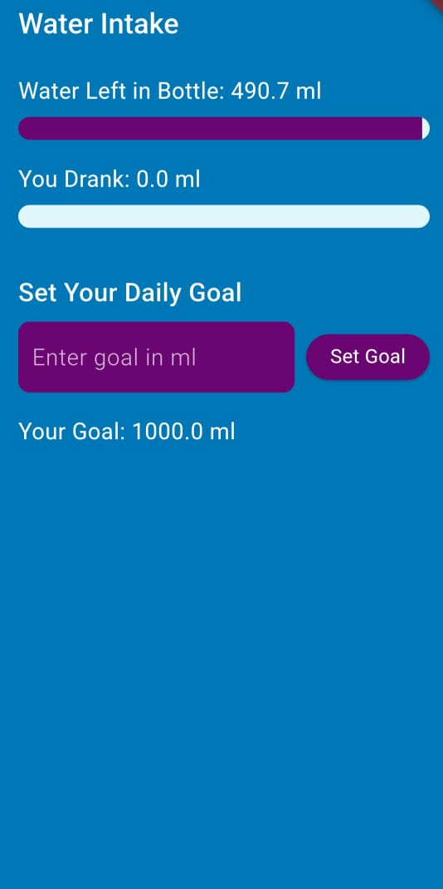
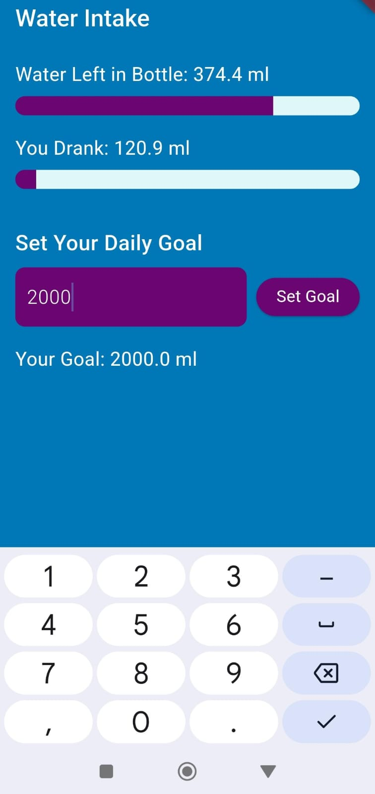
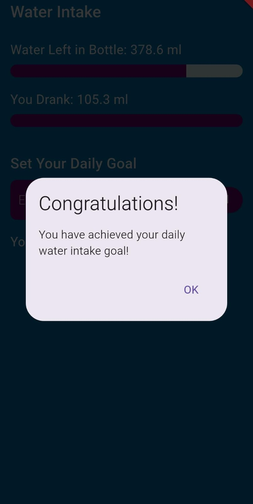
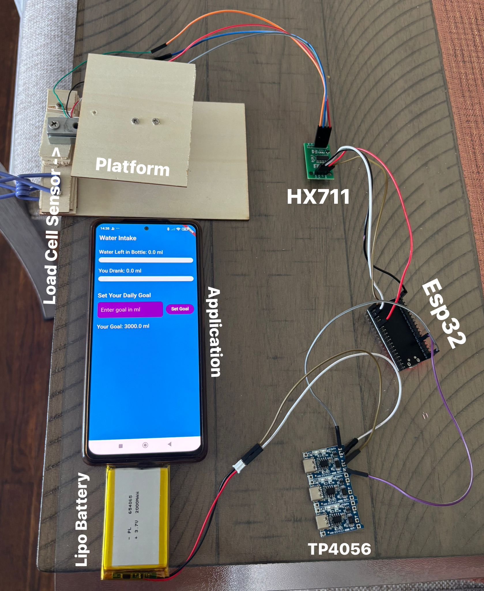

# **Thirst Watch**

Thirst Watch is a smart water intake tracking system designed to help users stay hydrated by providing accurate, real-time data about their water consumption. This project integrates **ESP32**, a **load cell sensor**, **Firebase**, and a **Flutter app** to monitor and display water intake seamlessly.

---

## **Features**
- **Real-Time Water Tracking**: Displays the amount of water left in the bottle and the total water consumed.
- **Smart Hardware Integration**: Uses a load cell sensor to measure the weight of the bottle placed on a wooden platform.
- **Firebase Integration**: Real-time data is sent from the ESP32 to Firebase and displayed in the Flutter app.
- **User-Friendly Interface**: The Flutter app features a visually appealing design with progress bars to track water intake.
- **Cross-Platform Support**: The app works seamlessly on Android devices.
- **Customizable Daily Goals**: Users can set their daily water intake goals and track their progress.

---

## **How It Works**
### **1. Hardware Setup**
- A **load cell sensor** is attached below a wooden platform to measure the weight of the bottle.
- The **HX711 module** amplifies the signal from the load cell sensor.
- The **ESP32** reads data from the HX711 module and calculates:
  - **Water Left**: The current weight of the water in the bottle.
  - **Water Drank**: The cumulative amount of water consumed.

### **2. Data Transmission**
- The ESP32 sends the data to **Firebase Realtime Database** using Wi-Fi.
- The data is updated in real-time and includes:
  - **Water Left**: The remaining water in the bottle.
  - **Water Drank**: The total water consumed.

### **3. Flutter App**
- The Flutter app fetches real-time data from Firebase and displays:
  - **Water Left in Bottle**: A progress bar showing the remaining water.
  - **You Drank**: A progress bar showing the total water consumed.
- Users can set daily water intake goals and track their progress visually.

---

## **Technologies Used**
### **Hardware**
- **ESP32**: Microcontroller for reading sensor data and sending it to Firebase.
- **Load Cell Sensor**: Measures the weight of the bottle.
- **HX711 Module**: Amplifies the signal from the load cell sensor.

### **Software**
- **MicroPython**: Used to program the ESP32.
- **Firebase Realtime Database**: Stores and syncs real-time data between the ESP32 and the Flutter app.
- **Flutter**: Cross-platform framework for building the mobile app.

---

## **Setup Instructions**

### **1. Hardware Setup**
1. Attach the **load cell sensor** below a wooden platform.
2. Connect the load cell to the **HX711 module**.
3. Connect the HX711 module to the **ESP32** as follows:
   - **DT** pin to GPIO 4.
   - **SCK** pin to GPIO 5.
4. Power the ESP32 using a USB cable or a battery.

### **2. ESP32 Code**
1. Write the ESP32 code in **MicroPython** to read data from the load cell and send it to Firebase.
2. Example code snippet for ESP32:
   ```python
   import time
   from hx711 import HX711
   from firebase import firebase

   # Initialize HX711
   hx = HX711(dout_pin=4, pd_sck_pin=5)
   hx.tare()

   # Firebase setup
   firebase_url = "https://your-firebase-database.firebaseio.com/"
   firebase_app = firebase.FirebaseApplication(firebase_url, None)

   while True:
       weight = hx.get_weight_mean(10)
       firebase_app.put('/water-intake', 'water_left', weight)
       time.sleep(1)

### **3. Firebase Setup**
1. Create a Firebase project in the Firebase Console (https://console.firebase.google.com/u/0/) 
2. Enable Realtime Database and set the rules to allow read and write access:
{
  "rules": {
    ".read": "true",
    ".write": "true"
  }
}
3. Add the Firebase configuration to your Flutter app.

### **4. Flutter App**
1. Clone this repository: 
git clone https://github.com/your-username/thirst-watch.git
2. Navigate to the project directory:
cd thirst-watch
3. Install dependencies:
flutter pub get
4. Run the app:
flutter run

## **App Interface**
### **Screenshots**

#### **1. Home Screen**


#### **2. Set Daily Goal**


#### **3. Goal Achieved Notification**


## **Hardware Setup**
### **Images**

### **Video Demonstration**
[Click here to watch the video](https://drive.google.com/file/d/1fC8U-SN5D2niCnymuzBcVBt0MhHlc-ej/view?usp=drivesdk)

## **Future Improvements**
1. Add notifications to remind users to drink water.
2. Add historical data tracking for water consumption.
3. Expand support for iOS devices.

## **Contributors**
Sarim Javed - Designer and Developer

## **License**
This project is licensed under the MIT License. See the LICENSE file for details.

## **Contact**
For any questions or feedback, feel free to reach out:

Email: javedsarim1111@gmail.com
GitHub: https://github.com/sarimjaved12

